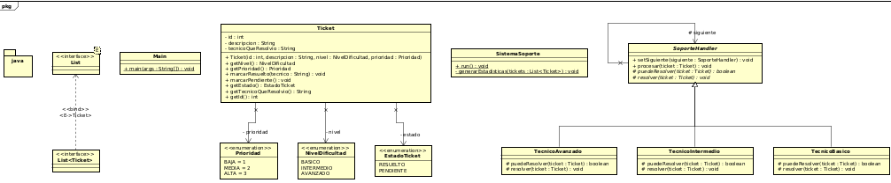
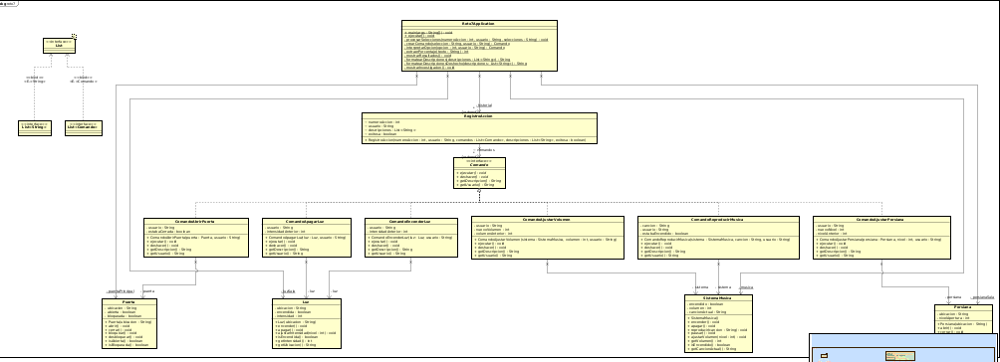
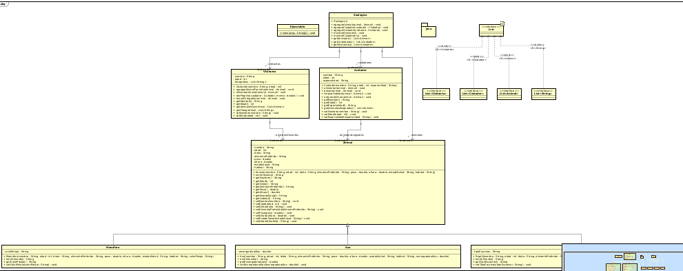

# DOSW\_Lab2.7

## Reto 6: Habla con soporte tecnico

**Patron de diseño:** De comportamiento

**Patron utilizado:** Chain of responsability

### Justificacion

En este caso se utilizo este patron de diseño por como esta abordado el problema, pues digamos que al tener que manejar los distintos niveles de prioridad este puede ir escalando como lo hace en cadena de responsabilidad

### Como lo aplico

---

## Reto 7: El control remoto mágico

**Patrón de diseño:** De comportamiento  
**Patrón utilizado:** Command  

### Justificación  

Se utilizó el patrón Command porque cada acción del control remoto se encapsula como un objeto independiente que puede ejecutarse y deshacerse. Esto permite desacoplar el control remoto de los dispositivos, registrar un historial de acciones y agregar nuevas funcionalidades sin modificar la estructura existente.

### Como lo aplico

---

## Reto 8: El zoológico de los UML

**Patrón de diseño:** Estructural  
**Patrón utilizado:** Decorator  

### Justificación  

Se utilizó el patrón Decorator para agregar atributos dinámicos a los animales sin modificar la clase base. Este patrón permite extender funcionalidades en tiempo de ejecución, combinar múltiples características adicionales y cumplir con el principio Open/Closed.

### Como lo aplico

